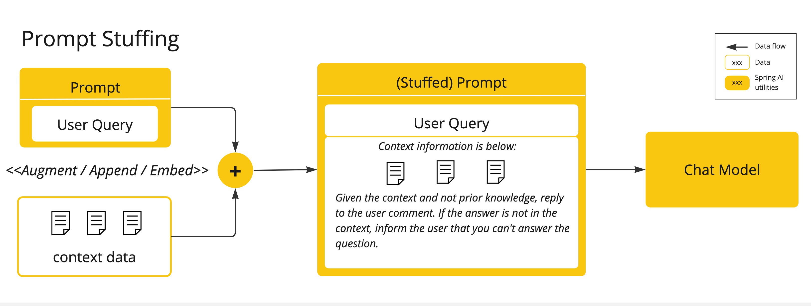
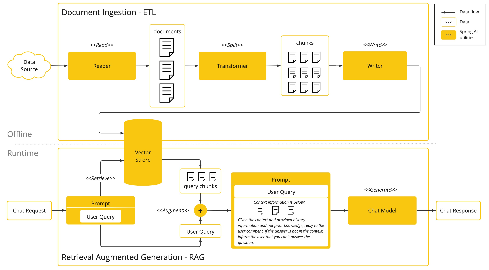
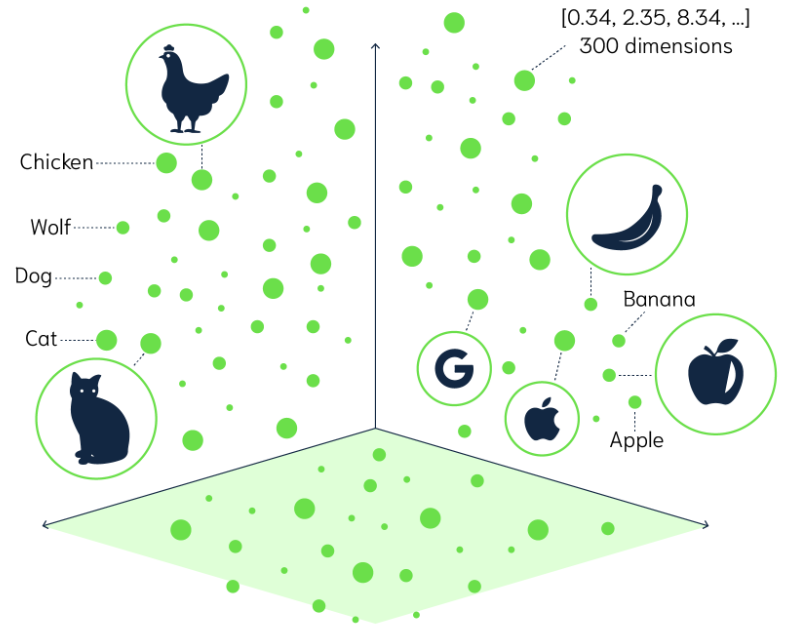
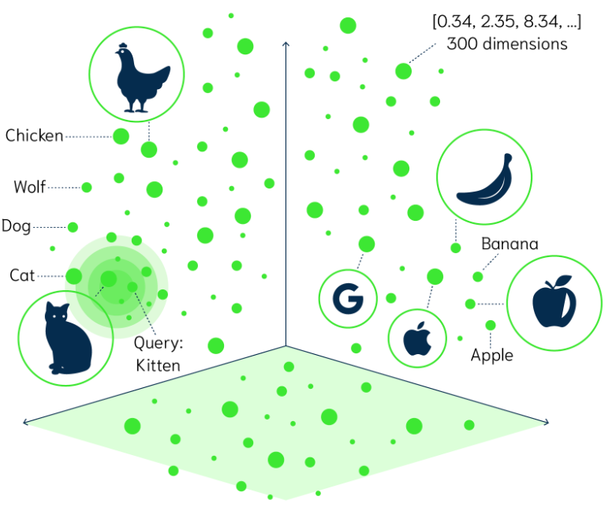
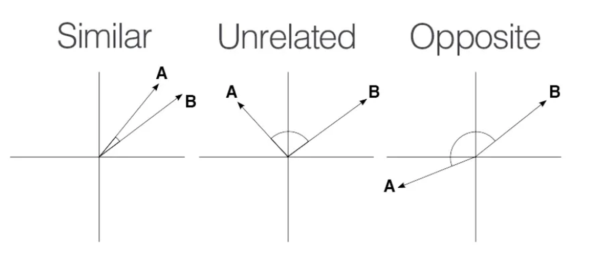
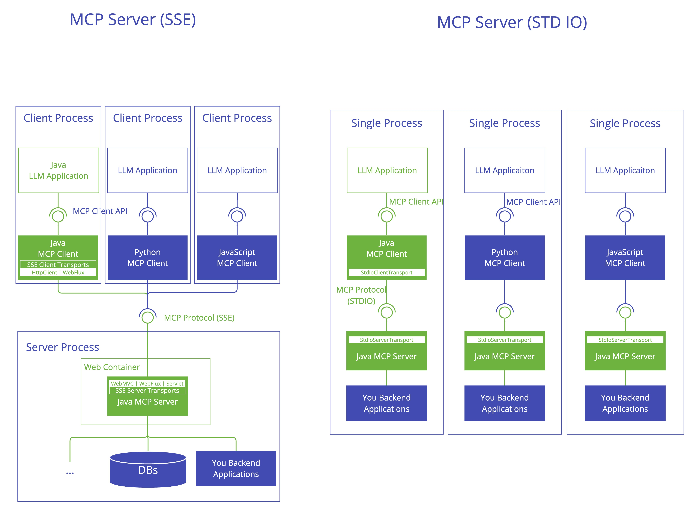

# What is an LLM (Large Language Mode)

An LLM, or Large Language Model, is a type of deep learning model specialized in understanding, generating,
and manipulating human language (natural language). These models are trained on massive datasets containing
text from books, articles, websites, and other sources to learn patterns, semantics, grammar, and even reasoning.

### 1. Core Concept
- Language Models predict the next word or token in a sequence given the previous context. For example, given the input “The cat sat on the”, the model predicts “mat” as a likely next word.
- Large refers to the scale of the model — usually billions or even trillions of parameters (the model’s learned weights). This scale allows the model to capture complex patterns, semantics, and nuanced language understanding.

### 2. How LLMs Work Internally
#### a) Architecture: Transformer
- Modern LLMs are mostly based on the Transformer architecture (introduced in 2017 by Ashish Vaswani and his colleagues at Google).
    - Paper "Attention is All You Need".https://proceedings.neurips.cc/paper_files/paper/2017/file/3f5ee243547dee91fbd053c1c4a845aa-Paper.pdf
- Transformers use self-attention mechanisms to weigh the importance of every word in the input relative to every other word.
- This enables the model to understand context deeply and handle long-range dependencies in text.

#### b) Training
- Trained on massive corpora with self-supervised learning.
- The model learns to predict missing or next tokens without explicit labeling.
- Example: Given a huge dataset, it learns probabilities of word sequences.

####  c) Parameters
- Parameters are weights that define the model.
- An LLM with billions of parameters has a vast capacity to encode language structure, facts, and some reasoning skills.

### 3. Capabilities of LLMs
- Text generation: Compose coherent, contextually relevant text.
- Translation: Convert text between languages.
- Summarization: Condense long documents into shorter summaries.
- Question answering: Provide answers based on input queries.
- Code generation: Write or complete programming code.
- Conversational agents: Power chatbots and virtual assistants.

### 4. Limitations
- Knowledge cutoff: LLMs only know what’s in their training data (usually up to a specific date).
- Hallucinations: Sometimes generate plausible-sounding but false or nonsensical outputs.
- Bias: Reflect biases in training data.
- Context window: Limited to a fixed-size input sequence (e.g., 4k or 8k tokens).

## Retrieval Augmented Generation - Bringing Your Data to AI

Retrieval Augmented Generation (RAG) is a technique useful to overcome the limitations of large language models that struggle with long-form content, factual accuracy, and context-awareness.

### RAG Architecture

### RAG Architecture - ETL

| Problem (without RAG)        | How RAG Helps                        |
|-----------------------------|--------------------------------------|
| LLM "hallucinates" facts     | Provides grounded reference data     |
| Limited knowledge cutoff     | Adds up-to-date external content     |
| Doesn’t know private info    | Can connect to internal docs         |

### Vector embedding
Vector embedding is a way to represent complex data (like words, sentences, images, or entire documents) as a vector of numbers in a high-dimensional space. These vectors are designed such that similar inputs are mapped to similar vectors, capturing the meaning, context, or structure of the original data.

#### Why Use Embeddings?
- Computers can't understand raw text or images directly.
- Embeddings turn those into numeric form that can be used for:
- Searching (semantic search)
- Recommendation systems
- Clustering/similarity
- Input to machine learning models
- Retrieval-Augmented Generation (RAG) in LLMs

#### Similarity
- Several mathematical formulas can be used to determine if two vectors are similar. One of the most intuitive to visualize and understand is cosine similarity. Consider the following images that show three sets of graphs:
  
- https://docs.spring.io/spring-ai/reference/api/vectordbs/understand-vectordbs.html

## Model Context Protocol (MCP)
- https://docs.spring.io/spring-ai/reference/api/mcp/mcp-server-boot-starter-docs.html
- https://docs.spring.io/spring-ai/reference/api/mcp/mcp-client-boot-starter-docs.html
- https://modelcontextprotocol.io/introduction
The Model Context Protocol (MCP) is a standardized protocol that enables AI models to interact with external tools
and resources in a structured way. It supports multiple transport mechanisms to provide flexibility across different environments.

