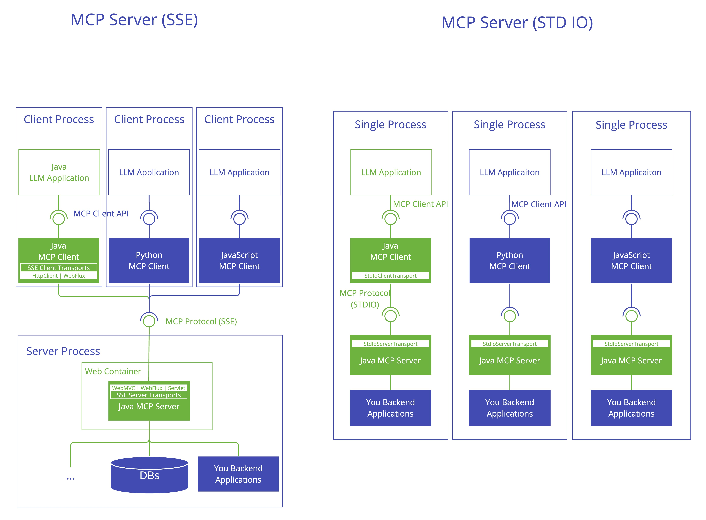

# Model Context Protocol (MCP)
The Model Context Protocol (MCP) is a standardized protocol that enables AI models to interact with external tools
and resources in a structured way. It supports multiple transport mechanisms to provide flexibility across different environments.

- https://modelcontextprotocol.io/introduction
- https://docs.spring.io/spring-ai/reference/api/mcp/mcp-server-boot-starter-docs.html
- https://docs.spring.io/spring-ai/reference/api/mcp/mcp-client-boot-starter-docs.html

