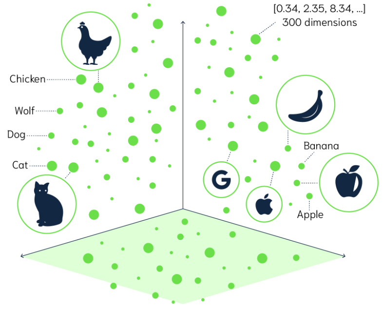
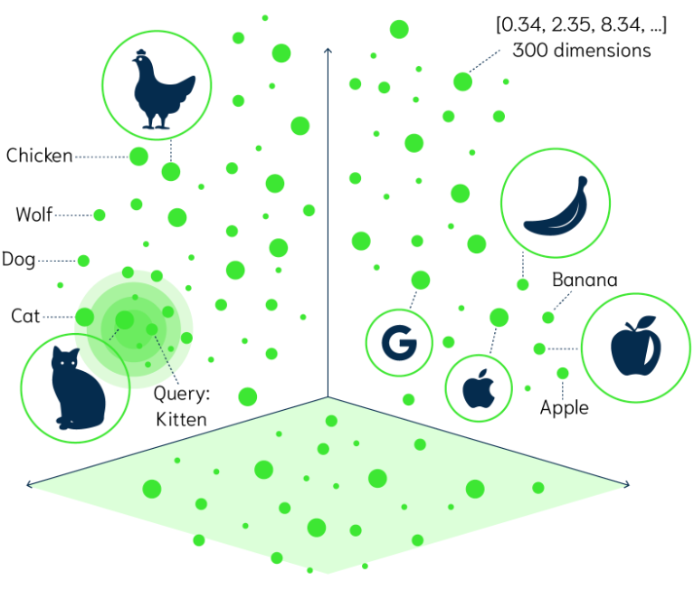
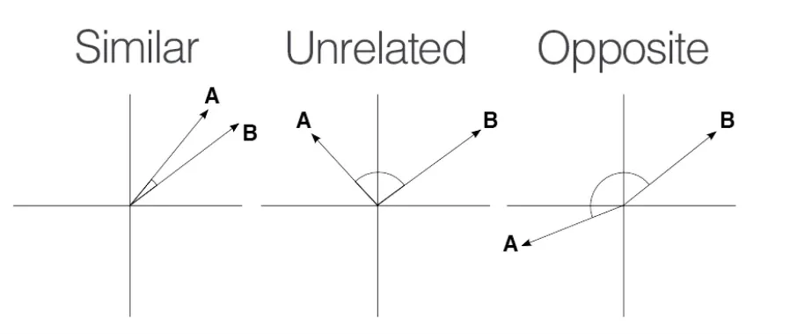

# Retrieval Augmented Generation - Bringing Your Data to AI

Retrieval Augmented Generation (RAG) is a technique useful to overcome the limitations of large language models that struggle with long-form content, factual accuracy, and context-awareness.

### RAG Architecture

### RAG Architecture - ETL

| Problem (without RAG)        | How RAG Helps                        |
|-----------------------------|--------------------------------------|
| LLM "hallucinates" facts     | Provides grounded reference data     |
| Limited knowledge cutoff     | Adds up-to-date external content     |
| Doesn’t know private info    | Can connect to internal docs         |

### Vector embedding
Vector embedding is a way to represent complex data (like words, sentences, images, or entire documents) as a vector of numbers in a high-dimensional space. These vectors are designed such that similar inputs are mapped to similar vectors, capturing the meaning, context, or structure of the original data.

#### Why Use Embeddings?
- Computers can't understand raw text or images directly.
- Embeddings turn those into numeric form that can be used for:
    - Searching (semantic search)
    - Recommendation systems
    - Clustering/similarity
    - Input to machine learning models
    - Retrieval-Augmented Generation (RAG) in LLMs

#### Similarity
- Several mathematical formulas can be used to determine if two vectors are similar. One of the most intuitive to visualize and understand is cosine similarity. Consider the following images that show three sets of graphs:
  
- https://docs.spring.io/spring-ai/reference/api/vectordbs/understand-vectordbs.html

---

### Semantic search vs Embeddings
###  **Semantic search**
Semantic search refers to the process of retrieving information based on the meaning of
a query, rather than relying solely on keyword matching. Semantic search is the retrieval strategy.

### **Embeddings**
Embeddings are numerical representations of a text that capture semantic relationships, enabling
algorithms to compare and match content based on similarity. Embeddings are the data format that
makes semantic search efficient.

