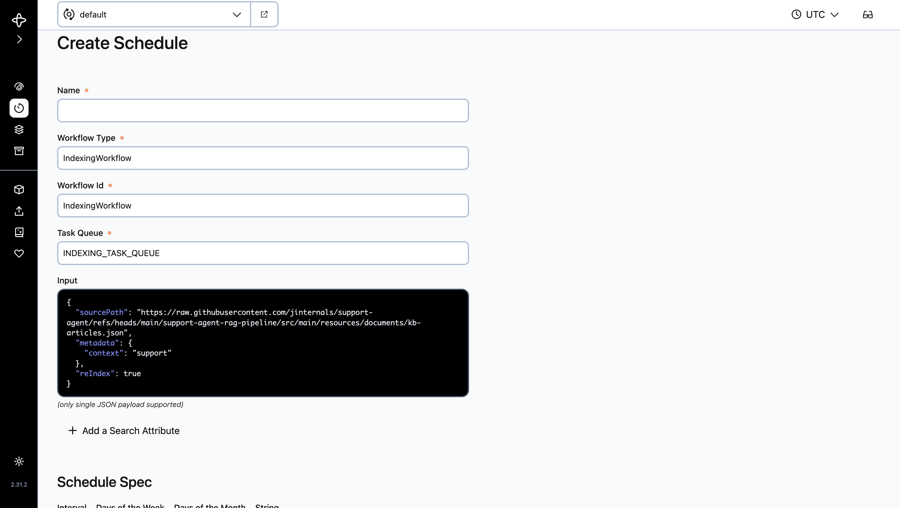
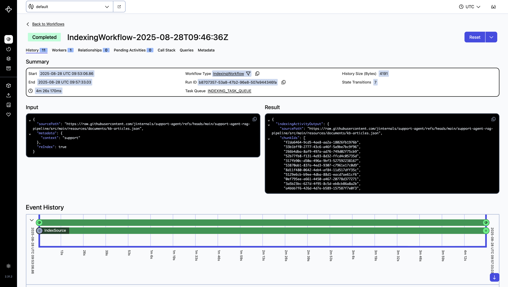

# support-agent-rag-pipeline

This pipeline demonstrates how to store data vectors in a Qdrant vector store, using the [Temporal](https://temporal.io/) workflow engine for orchestration.

To run the pipeline, you must have a Temporal server running. Refer to the `docker-compose.yml` file for setup and configuration details.

### Create a schedule job:

### View running job:
